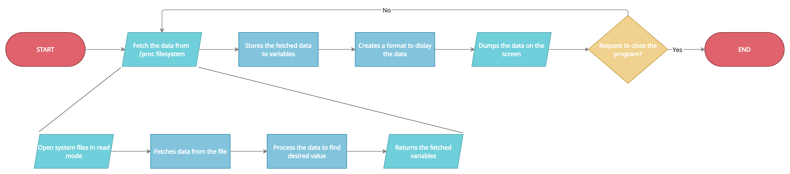
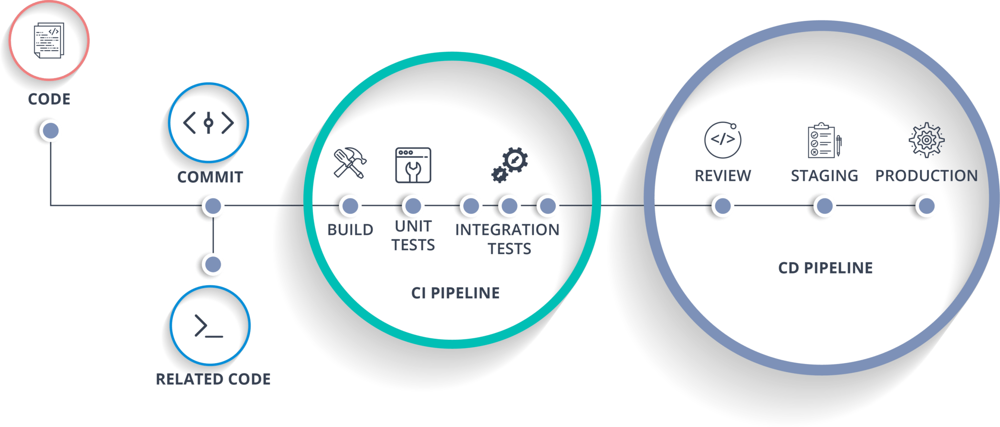
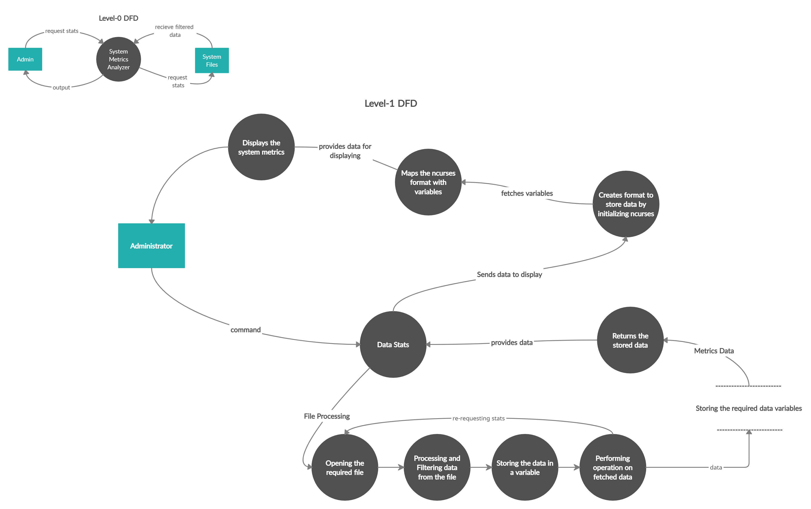

# Mutex: The System Metrics Analyzer

<table>
<tr>
<td width="113px">

</td>

<td>
Mutex: The System Metrics Analyzer is a Command-Line utility to visualize the live health of our system which focuses on fetching data through system files, processing and dumping it highlighting the features of Linux System Architecture.
</td>
</tr>
</table>

The main objective of the project is to implement the System Metrics Analyzer.

Sub-objectives for the project are:
* Fetching the data from system files.
* Processing the data to gather useful information.
* Implementing the System Metrics Analyzer as a Command Line utility.
* Packaging the whole project and deploying it using a CI-CD pileline.

## Abstract

System Metrics also referred as System Health allows the user to measure the system’s vital resources as well as the system performance in real time. System Metrics plays an important role in the IT Industry as it helps the IT Support team to take the decisions based on system health and checks  regularly if the devices are performing at the levels required of it and is it sufficient to satisfy the user and client demands. In the project “Mutex: The System Metrics Analyzer”, we aim to build a Command-Line based system analytics tool to visualize the live health of our system.

## Workflow

First of all, this System Metrics Analyser process and filter data from the desired files such as /proc/uptime, /proc/{PID}, etc stored in /proc directory. After processing the data, it gets stored in some variables and then operations are performed on the fetched data. Now, this data is ready to get displayed. ncurses display library creates a format to display the data on the screen and the data is dumped on the screen.

Here, the process of fetching the data from the /proc filesystem is further divided into 4 subprocesses, where first of all, the file is opened in read mode, further the data is read from the files and processed to fetch the desired values from the data. After fetching all the desired values, the data is returned for further processing.

Further, we would like to package our project in a Full-Fledged DevOps Pipeline using the DevOps tools like, Jenkins, Ansible and AWS Cloud.

## Data Flow Diagram

-------------

Full documentation of the project is available under [Project Synopsis.](docs/synopsisReport.pdf)

-------------

The contribution guidelines are present in [CONTRIBUTING.md](docs/CONTRIBUTING.md)

-------------

The project is licensed under [GNU General Public License](LICENSE)

-------------

For the project contributions, you need to accept the following [Code of Conduct](docs/CODE_OF_CONDUCT.md)